# Bite by Bite

A humorous, low-poly, real-time stealth-puzzle game: you control a small squad of specialised zombies,
infect humans to recruit them into your **Horde Deck**, and assemble the perfect horde for each outbreak.

Built with [Clayground](https://github.com/MisterGC/clayground) (Qt 6 / QML); 3D assets made with
[QtMeshEditor](https://github.com/fernandotonon/QtMeshEditor). MIT License.

This repository is the **vertical slice**: one complete mission, *Night Shift at St. Rotter Hospital*.

## Play

```
export QT_ROOT=~/Qt/6.11.1/macos            # Qt 6.10+ with Quick3D, Quick3D Physics, Timeline, Multimedia
git submodule update --init --recursive
cmake --preset desktop && cmake --build --preset desktop --target bite_by_bite
./build-desktop/bin/bite_by_bite.app/Contents/MacOS/bite_by_bite
```

| Action | Keyboard | Gamepad (standard layout) |
|---|---|---|
| Move | WASD / arrows | left stick / d-pad |
| Run · Sneak | Shift · Ctrl (C) | right trigger · left trigger |
| Interact (doors, radio, panel, hide) | E / Space | A (south) |
| Bite / infect | F | X (west) |
| Character ability | Q | Y (north) |
| Switch zombie | Tab / Shift-Tab, or 1–9 | RB / LB |
| Squad stay / follow | H | B (east) |
| Restart from checkpoint | R | Select |
| Pause | Esc / P | Start |

Physical gamepads are read through `app/src/gamepadbridge.mm` (Apple GameController framework on macOS;
other platforms report "not connected" until a backend is added behind the same properties).

## The loop

Main menu → Outbreaks (mission select) → Briefing → Squad selection (up to 2 from the unlocked deck, 3 in the
finale) → the mission → Results (rating from the optional objectives) → the Horde Deck now holds every human you
infected → replay with a different squad to find other routes.

## The campaign

| # | Mission | Recruits | New mechanics |
|---|---|---|---|
| 1 | Night Shift at St. Rotter Hospital | Electrician, Nurse | the tutorial: detection, noise, biting, squad, sabotage |
| 2 | Mall After Closing | Chef, Security Guard | security doors, sealed shutters + controls, food bait, a guard dog, vents |
| 3 | Detention of the Dead | Kid, Athlete | vaults, timed switches, a two-switch exit, the bell |
| 4 | Graveyard Shift Inc. | Office Worker | terminals and badge readers (permanent) vs. sabotage (temporary), an elevator |
| 5 | Firehouse Fever | Firefighter | fire (impassable) and smoke (coughing), valves, sprinklers, a ventilation fan |
| 6 | Dead Air | Screamer | the directed scream, live-microphone zones, the broadcast desk |
| 7 | Outbreak Protocol | Doctor | medical doors, sedation, containment cells, a squad of three |

Completing a mission unlocks the next; every mission stays replayable, and later characters open shortcuts in
earlier levels (the Kid's vents, the Security Guard's doors, the Brute's weak walls, the Electrician's panels).
Each mission is one data file in `app/config/` and one Node test file that walks its full route.

## Play in the browser

The game is published on GitHub Pages: **https://fernandotonon.github.io/Bite-by-Bite/** - desktop browsers with a
keyboard or a standard-layout gamepad, and phones/tablets in landscape (touch controls appear on the first touch:
floating stick on the left, action buttons on the right; effects are reduced there).

```
scripts/build-wasm.sh          # Qt 6.11.1 wasm_multithread + emsdk 4.0.7 -> deploy/multithread
python3 scripts/serve.py deploy/multithread              # local test with COOP/COEP headers
node scripts/browser-check.mjs "http://localhost:8080/index.html?args=--autotest" --seconds 90
scripts/deploy-pages.sh        # manual: pushes deploy/multithread to the gh-pages branch
```

Every push to `main` runs `.github/workflows/deploy.yml`: Node rule checks, the WebAssembly build on Ubuntu
(Qt 6.11.1 + emsdk 4.0.7 via aqt), a headless-Chrome autotest of the built page, then GitHub Pages (source:
GitHub Actions).

On the web the save data lives in `localStorage`, audio goes through the browser `AudioContext`, and the 3D
runtime assets are preloaded into Qt's in-memory filesystem (`/game/assets/...`) by the loading page; the
bundled service worker (`web/bite-sw.js`) adds the cross-origin-isolation headers GitHub Pages cannot send and
caches the game files per build.

## Development

```
QT_DISABLE_SHADER_DISK_CACHE=1 ~/clayground/build/bin/claydojo --sbx app/Sandbox.qml   # live reload
clayrender app/Sandbox.qml --out shot.png --size 1400x800 --eval 'game.debugStart()'      # screenshot
node tests/sim.test.js && node tests/data.test.js                                        # rules, no Qt
QT_QPA_PLATFORM=minimal QT_QUICK_BACKEND=software build-desktop/bin/bite_by_bite.app/Contents/MacOS/bite_by_bite --autotest
ctest --preset desktop                                                                    # all of the above
```

Flags: `--no-models` (toon placeholders only), `--autostart` (skip the menus), `--autotest` (headless wiring check).

* `docs/architecture.md` - how the pieces fit (data → simulation → presentation) and how to add characters / missions.
* `docs/asset-pipeline.md` - QtMeshEditor → balsam pipeline and the exact generation settings.

## Screenshots

| | |
|---|---|
| 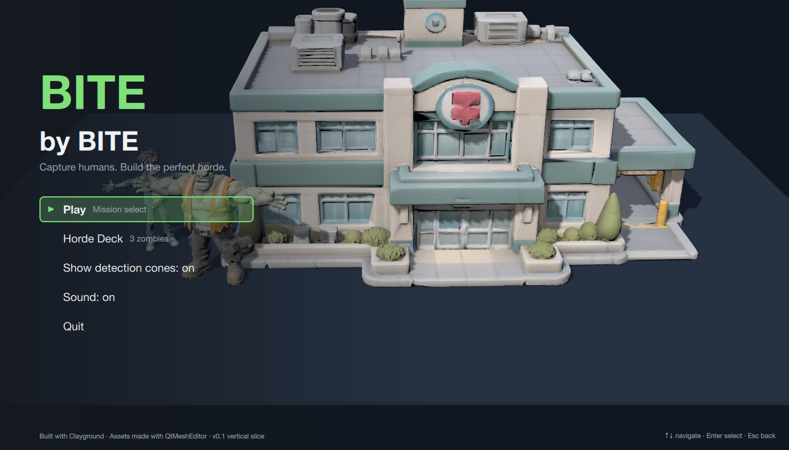 | 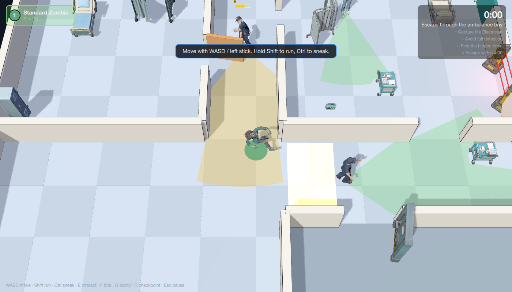 |
| 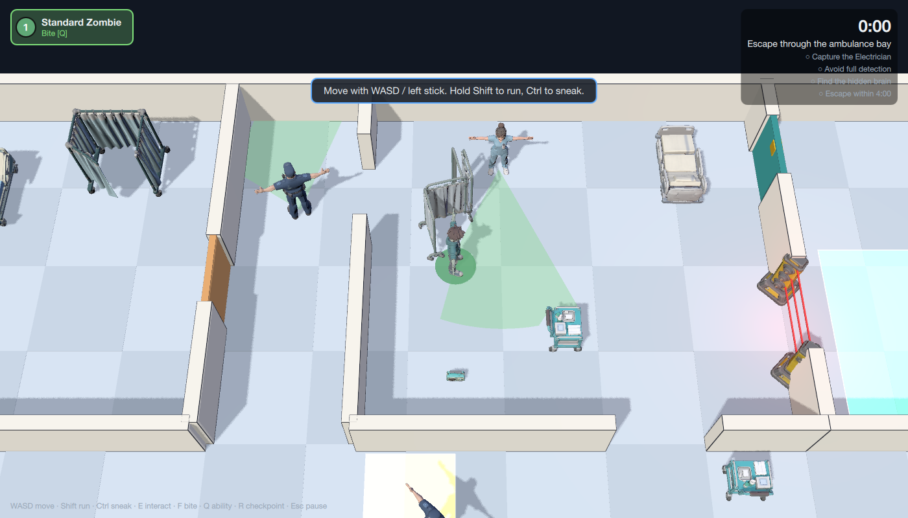 | 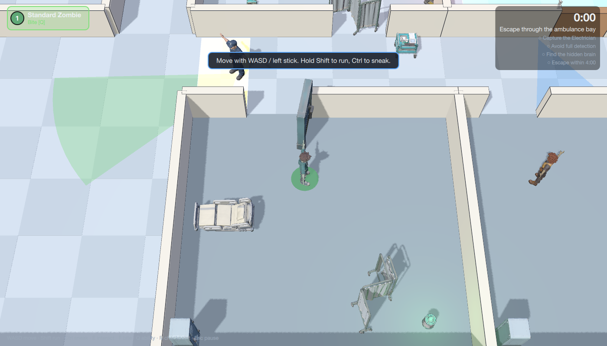 |
| 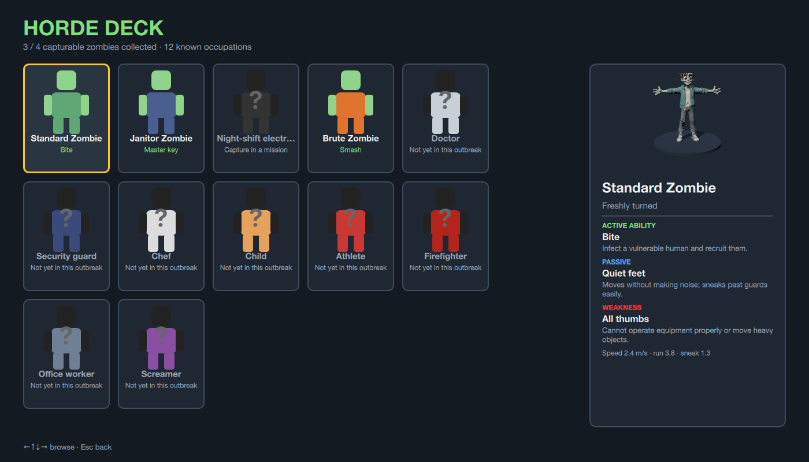 | 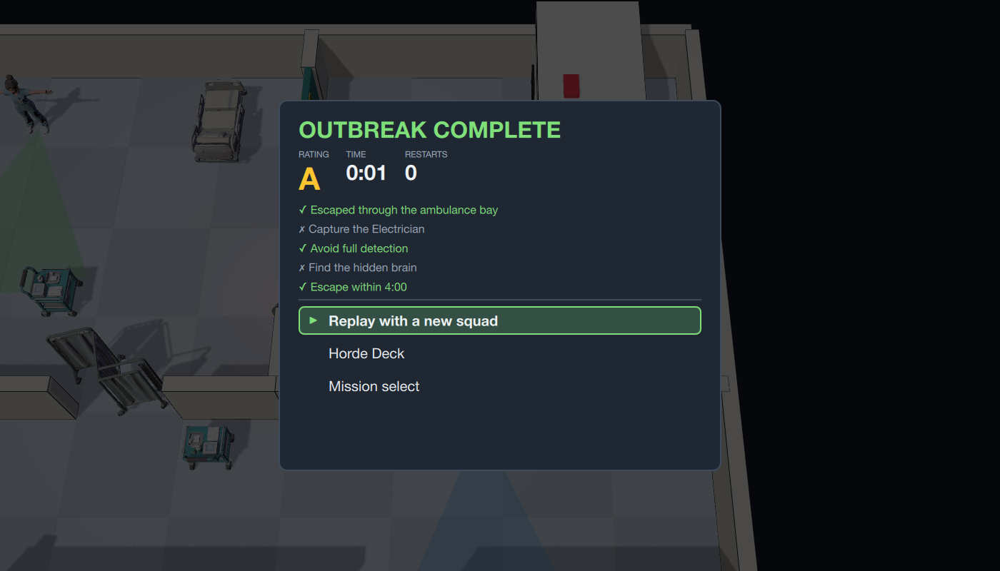 |
| 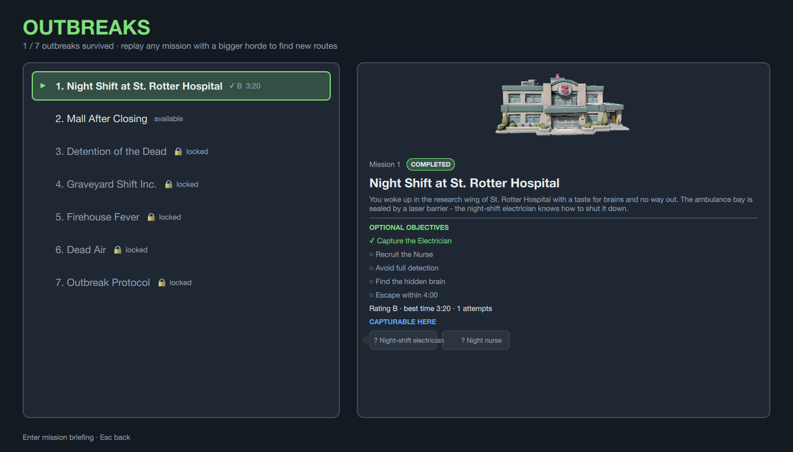 | 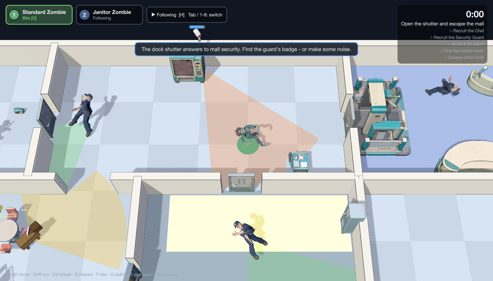 |
| 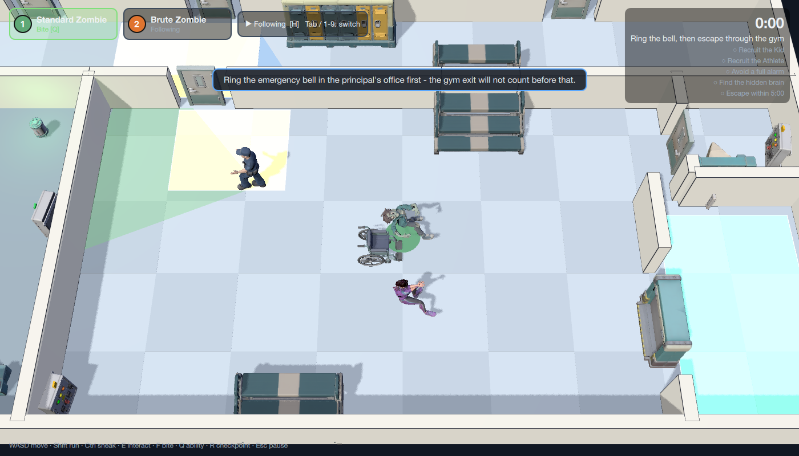 | 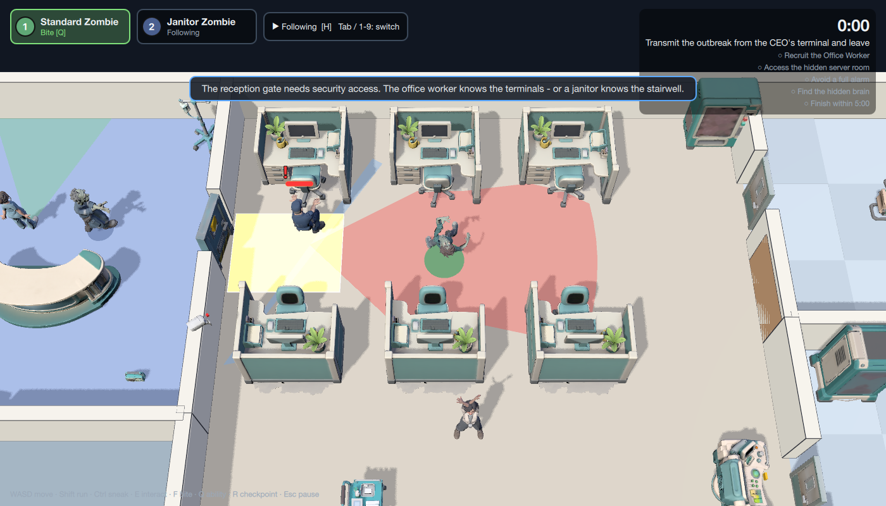 |
| 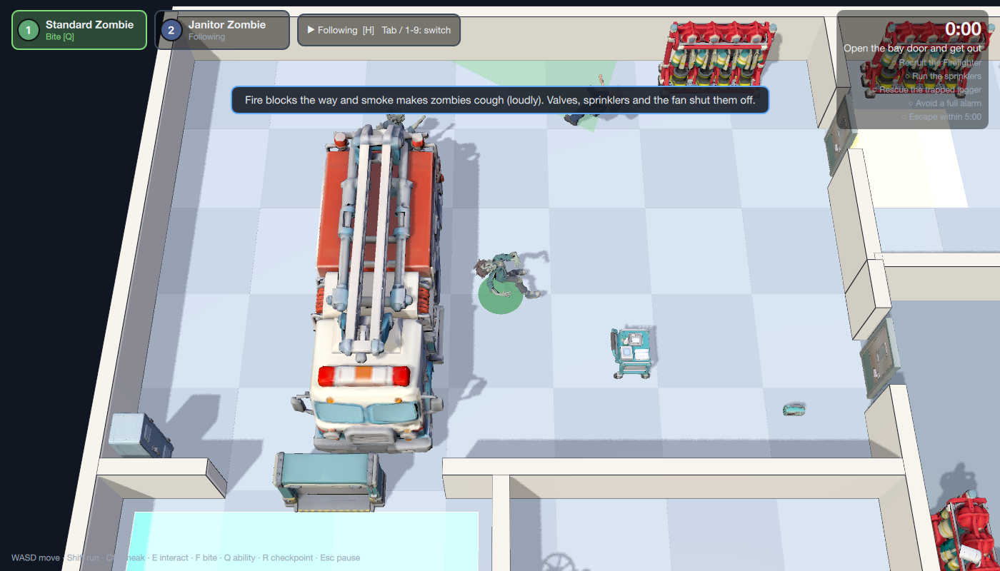 | 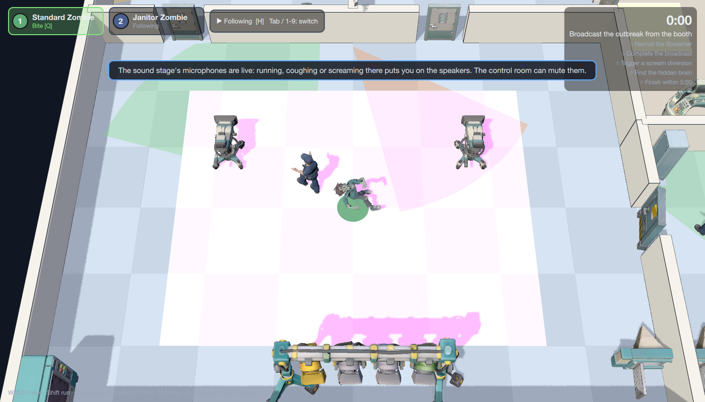 |
| 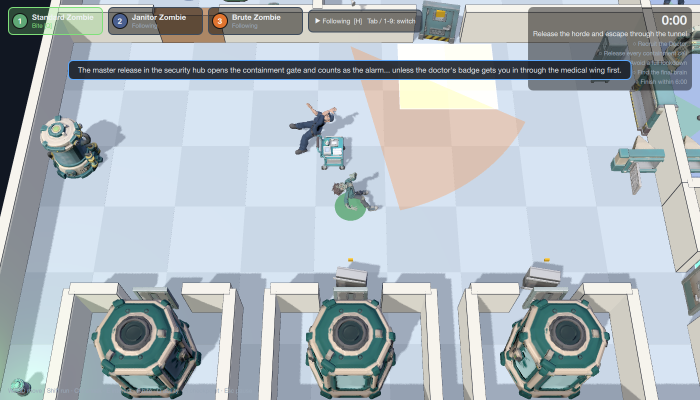 | |

## Status

Seven-mission campaign with local persistence (Clayground `KeyValueStore`). The hospital's 19 assets and the roster's
22 (zombies, humans, doors, ambulance, props) are generated (11 with the `balanced` TRELLIS preset, 8 props fell back to `fast` after the balanced cascade stalled -
see `docs/asset-pipeline.md`); the six humanoids are rigged with Idle / Walk / Run / Bite clips.
PLACEHOLDERS still in use: synthesized audio cues (`scripts/gen-audio.py`), the guard dog, the food bait, the
firehouse ventilation fan (its generation failed twice), deck portraits (drawn silhouettes). Every other asset -
71 models - is generated from the concept art in `docs/concept/`.
